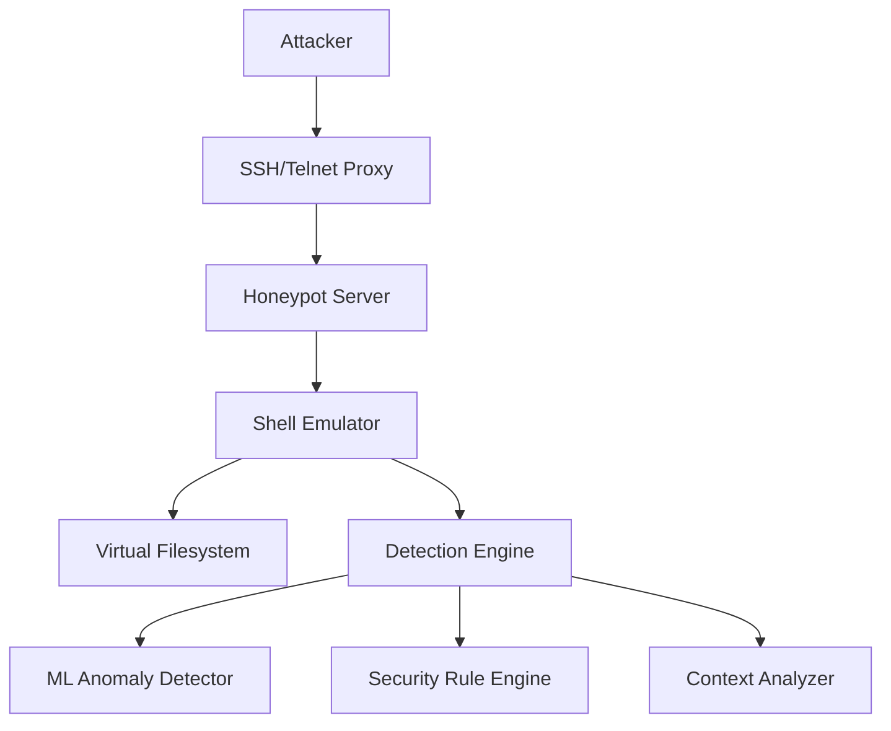

# Cyanide Technical Architecture

This document provides a deep dive into the internal mechanics of the Cyanide Honeypot. For recent improvements and stabilization details, see the **[Stabilization & Logging Notes](stabilization_notes.md)**.

## 🏛️ System Overview

Cyanide is designed with a modular architecture that separates network handling, system emulation, and threat detection.

---

## 1. Core Orchestration (`src/cyanide/core`)

Detailed technical implementation available in **[Core Orchestration Architecture](core.md)**.

### `CyanideServer`
The central brain of the system. It initializes all sub-services and manages the lifecycle of attacker sessions.
- **Service Management**: Starts the SSH/Telnet handlers, Metrics server, and Logging infrastructure.
- **Backend Routing**: Decides whether a session should be handled by the **Emulator** (default) or forwarded to a real backend via **Proxy Mode**.
- **Audit Logging**: Captures all interactions for forensics and analytics.

### `ShellEmulator`
A full state-machine that simulates a Linux shell environment.
- **Parsing**: Handles complex command chains (`&&`, `||`, `;`), pipes (`|`), and redirections (`>`, `>>`).
- **Environment**: Manages per-session environment variables, user context (`UID/GID`), and the Current Working Directory (CWD).
- **Execution**: Dispatches commands to the emulated command library or user-defined scripts.

---

## 2. Virtual Filesystem (VFS)

Detailed technical implementation available in **[VFS Architecture](../vfs/vfs.md)**.

The VFS is a declarative, profile-based system that mirrors a real Linux disk without touching the host's filesystem.

### "Template + Context" Model
- **Context**: Profiles (Ubuntu, Debian, CentOS) provide metadata like `kernel_version`, `hostname`, and `os_name`.
- **Templating**: Files use Jinja2 to dynamically render content based on the session's context.
- **Laziness**: Using `VirtualNode` proxies, the filesystem only loads file contents or directory structures when they are explicitly accessed.
- **Memory Overlay**: All changes (creating files, deleting, modifies) are stored in an in-memory overlay. The base OS profile remains immutable.
- **Caching**: A two-tier SQLite and memory cache prevents redundant YAML parsing. Read the [Profile Caching Architecture](caching.md) for details.

### Dynamic Nodes
Found in `/proc`, these nodes call **Providers** to generate data on the fly, such as:
- **Uptime**: Increments naturally and reflects the emulated startup time.
- **CPU Info**: Returns realistic hardware specifications based on the profile.

---

## 3. Detection Engine (`src/cyanide/ml`)

Detailed technical implementation available in **[Detection Engine Architecture](../ml-analytics/ml.md)**.

Cyanide uses a **Hybrid Detection System** that combines deterministic rules with probabilistic ML models.

### Layer 1: ML Anomaly Detector (Probabilistic)
An **LSTM Autoencoder** tokenizes command strings at the character level. It calculates a "Reconstruction Error"—the more "unseen" or "weird" a command looks (obfuscation, base64 payloads), the higher the score.

### Layer 2: Security Rule Engine (Deterministic)
A regex-based engine that flags known malicious patterns (e.g., `wget | bash`, `iptables -F`, use of common exploit tools). This provides high-confidence alerts with specific MITRE ATT&CK technique IDs.

### Layer 3: Context Analyzer (Semantic)
Analyzes the *targets* of commands. Accessing sensitive files like `/etc/shadow` or connecting to known malicious domains/IPs will elevate the threat level of otherwise normal-looking commands.

---

## 4. Network & Proxy (`src/cyanide/network`)

Detailed technical implementation available in **[Network & Proxy Architecture](../networking/network.md)**.

- **TCP Proxy**: Generic forwarder for non-emulated services (e.g., SMTP).
- **SSH Proxy**: Advanced MitM module that allows decrypting and logging sessions heading to real backends.
- **Network Jitter**: Artificially adds 50-300ms of latency to responses to defeat primitive honeypot fingerprinting tools.
